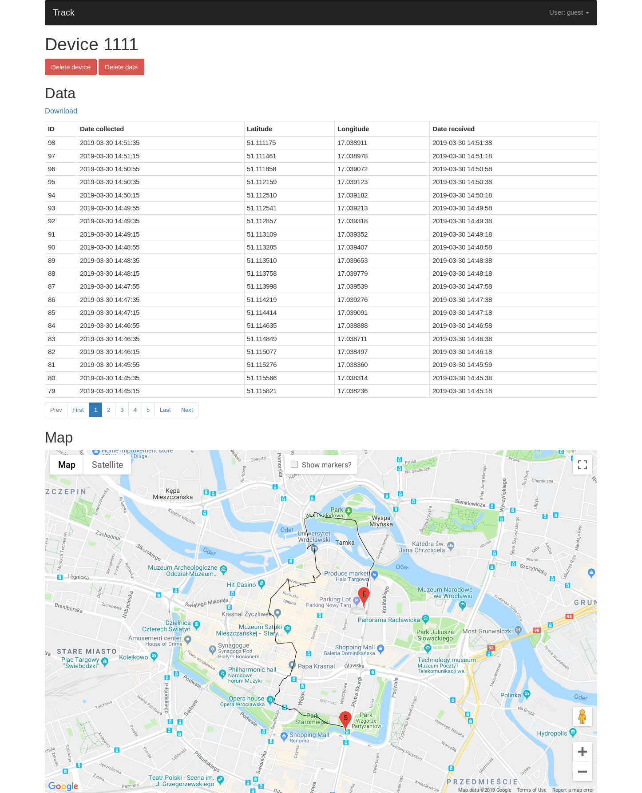

# GPS tracker
This project consists of **(a)** an Arduino board collecting GPS coordinates and sending them to the web server and **(b)** a Django application storing and displaying location data.

## Hardware
* Arduino Mega 2560: [amazon](https://www.amazon.co.uk/dp/B06XKHN62M/)
* GY-NEO6MV2 GPS module: [amazon](https://www.amazon.co.uk/AZDelivery-Shield-Module-Ethernet-Book/dp/B01N38EMBF/)
* SIM800L EVB GSM module: [amazon](https://www.amazon.co.uk/TECNOIOT-SIM800L-Wireless-Quad-Band-Quadband/dp/B07LH3PLB2/) + micro SIM card with data connection
* Micro SD card module: [amazon](https://www.amazon.co.uk/gp/product/B06XHJTGGC/) + micro SD card
* 2A 5V power supply, e.g. a powerbank

## Wiring

GY-NEO6MV2 pin | Connected to
---------------|:------------
VCC | 5V power supply
RX | GND
TX | Arduino pin 17 (Serial2 RX pin)
GND | GND

SIM800L EVB pin | Connected to
----------------|:------------
5VIN | 5V power supply
GND | GND
TXD | Arduino pin 19 (Serial1 RX pin)
RXD | Arduino pin 18 (Serial1 TX pin)

Micro SD pin | Connected to
-------------|:------------
CS | Arduino pin 53
SCK | Arduino pin 52
MOSI | Arduino pin 51
MISO | Arduino pin 50
VCC | Arduino 5V pin
GND | GND

## Installation

### Arduino
* Install libraries listed in `arduino/libraries.txt`:
  * Metro: [https://github.com/thomasfredericks/Metro-Arduino-Wiring](https://github.com/thomasfredericks/Metro-Arduino-Wiring)
  * TinyGPS+: [https://github.com/mikalhart/TinyGPSPlus](https://github.com/mikalhart/TinyGPSPlus)
* `cd arduino/track; cp settings.cpp.template settings.cpp` and set correct values in `settings.cpp`

### Django
Settings files are located in `web/track/settings/`.

## Usage
* Go to the website, create account, log in and create a device 
* Copy the generated API key to `api_key` in `arduino/track/settings.cpp`
* Upload `track.ino` sketch to Arduino
* Go to the device page and have a look at the data collected

## Power consumption
The whole setup draws around 200 mA on average, out of which 80 mA is drawn by the Arduino board.

## Future work
* HTTPS 
* Timestamps in user timezone

